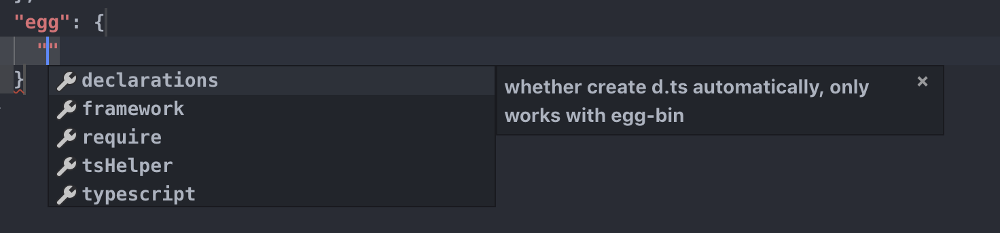

# egg-pkg-schema

[![NPM version][npm-image]][npm-url]
[![build status][travis-image]][travis-url]
[![Test coverage][codecov-image]][codecov-url]
[![David deps][david-image]][david-url]
[![Known Vulnerabilities][snyk-image]][snyk-url]
[![NPM download][download-image]][download-url]

[npm-image]: https://img.shields.io/npm/v/egg-pkg-schema.svg?style=flat-square
[npm-url]: https://npmjs.org/package/egg-pkg-schema
[travis-image]: https://img.shields.io/travis/{{org}}/egg-pkg-schema.svg?style=flat-square
[travis-url]: https://travis-ci.org/{{org}}/egg-pkg-schema
[codecov-image]: https://codecov.io/gh/{{org}}/egg-pkg-schema/branch/master/graph/badge.svg
[codecov-url]: https://codecov.io/gh/{{org}}/egg-pkg-schema
[david-image]: https://img.shields.io/david/{{org}}/egg-pkg-schema.svg?style=flat-square
[david-url]: https://david-dm.org/{{org}}/egg-pkg-schema
[snyk-image]: https://snyk.io/test/npm/egg-pkg-schema/badge.svg?style=flat-square
[snyk-url]: https://snyk.io/test/npm/egg-pkg-schema
[download-image]: https://img.shields.io/npm/dm/egg-pkg-schema.svg?style=flat-square
[download-url]: https://npmjs.org/package/egg-pkg-schema

## Usage

Execute cmd in your egg project.

```bash
$ npx egg-pkg-schema
```

Using in your package.json


